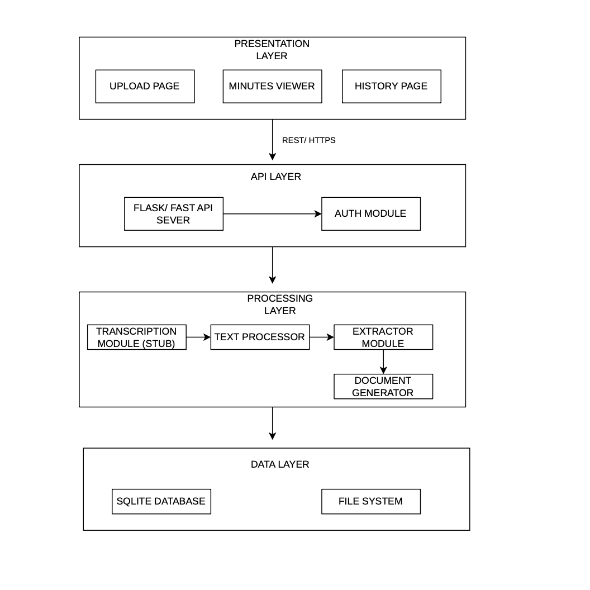
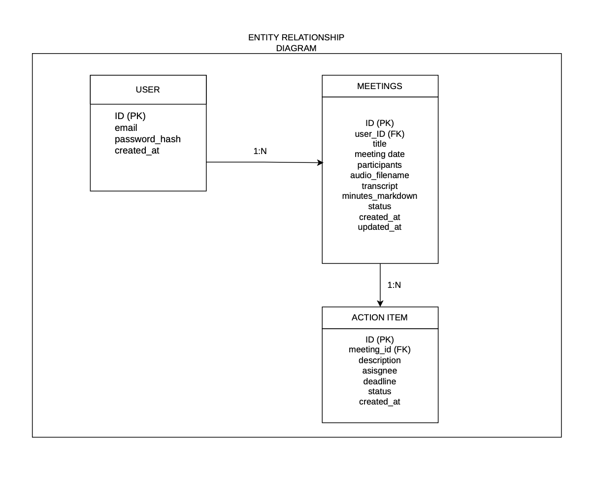

# Software Architecture and Design Specification (SAD)

## Automated Meeting Minutes Generator

| Field | Details |
|---|---|
| **Project** | Automated Meeting Minutes Generator (MiniMax) |
| **Version** | 1.0 |
| **Date** | September 2026 |
| **Authors** | Mohammed Faizan, Kamal Kanth N, Vinay M Rampur, Anagha Kaushik |
| **Status** | Draft |

---

### Team Members & SRN

| Name | SRN | Role |
|---|---|---|
| **Mohammed Faizan** | PES1UG24AM472 | Team Lead / Backend |
| **Vinay M Rampur** | PES1UG24AM455 | Backend Developer |
| **Kamal Kanth N** | PES1UG24AM434 | Frontend Developer |
| **Anagha Kaushik** | PES1UG24AM459 | Testing & Documentation |

### Revision History

| Version | Date | Author | Change Summary |
|---|---|---|---|
| 0.1 | DD-MM-2026 | Mohammed Faizan | Architecture and component design |
| 0.2 | DD-MM-2026 | Vinay M Rampur | API design and sequence diagrams |
| 0.3 | DD-MM-2026 | Kamal Kanth N | UX design and wireframes |
| 0.4 | DD-MM-2026 | Anagha Kaushik | Security architecture, DB design, error handling |
| 1.0 | DD-MM-2026 | All | Final reviewed version |

### Approvals

| Role | Name | Signature / Email | Date |
|---|---|---|---|
| Course Coordinator | | | |

---

## Table of Contents

1. Introduction
2. Document Overview
3. Architecture
4. Design
5. Appendices

---

## 1. Introduction

### 1.1 Purpose

This document specifies the software architecture and detailed design of the Automated Meeting Minutes Generator system. It translates the requirements defined in the SRS (v1.0) into a concrete technical blueprint that developers can follow to implement the system.

### 1.2 Scope

This document covers the architecture and design of the complete Meeting Minutes Generator system, including:

- The web-based frontend for audio upload, minutes viewing, and history browsing
- The backend REST API server
- The processing pipeline (Transcription stub, Text Extraction, Document Generation)
- The data persistence layer (SQLite database)
- Security architecture and threat modeling

### 1.3 Audience

- **Developers** — to understand the system architecture and implement modules
- **QA Engineers** — to understand component boundaries for test planning
- **Security Auditors** — to review the threat model and security controls
- **Course Instructors** — to evaluate design quality and SE process adherence
- **Maintenance Teams** — to understand the system for future modifications

### 1.4 Definitions

| Term | Definition |
|---|---|
| SAD | Software Architecture and Design Document |
| SRS | Software Requirements Specification |
| STP | Software Test Plan |
| RTM | Requirements Traceability Matrix |
| REST | Representational State Transfer |
| API | Application Programming Interface |
| ORM | Object-Relational Mapping |
| STRIDE | Spoofing, Tampering, Repudiation, Information Disclosure, Denial of Service, Elevation of Privilege |
| ADR | Architecture Decision Record |
| CRUD | Create, Read, Update, Delete |
| JWT | JSON Web Token |
| CORS | Cross-Origin Resource Sharing |

---

## 2. Document Overview

### 2.1 How to Use This Document

This document provides architectural deliverables including:

- **Section 3 (Architecture):** High-level system architecture, component diagrams, technology choices, security threat model, and traceability to SRS requirements.
- **Section 4 (Design):** Detailed module design with UML sequence diagrams, REST API specifications, database schema, error handling strategy, and UX wireframes.

Read Section 3 first for the big picture, then Section 4 for implementation details.

### 2.2 Related Documents

| Document | Version | Description |
|---|---|---|
| SRS | v1.0 | Software Requirements Specification — defines what the system must do |
| STP | v1.0 (pending) | Software Test Plan — defines how the system will be tested |
| RTM | v1.0 | Requirements Traceability Matrix — maps requirements to modules and tests |

---

## 3. Architecture

### 3.1 Goals & Constraints

**Goals:**

- **Modularity** — Each processing stage (transcription, extraction, generation) is an independent module that can be developed, tested, and replaced independently
- **Extensibility** — The stub transcription module can be swapped for a real ASR engine (e.g., Whisper API) without changing the rest of the pipeline
- **Simplicity** — Use straightforward, well-documented technologies suitable for a team of 4 developers
- **Security** — Protect user credentials and ensure data isolation between users

**Constraints:**

- Transcription is a **stub** — no real speech recognition
- Must use **open-source** libraries only
- Single-tenant deployment (one team/organization)
- Audio file size limited to **100 MB**
- Must run on standard hardware (no GPU required)

### 3.2 Stakeholders & Concerns

| Stakeholder | Concerns |
|---|---|
| **Users (Meeting Organizer)** | Fast processing, intuitive UI, accurate extraction, reliable PDF export |
| **Developers** | Clean module boundaries, simple APIs, easy debugging |
| **Course Instructor** | Proper SE process, clear architecture documentation, adherence to design patterns |
| **QA Team** | Testable components, clear interfaces, reproducible results |

### 3.3 Component (UML) Diagram



### 3.4 Component Descriptions

| Component | Responsibility | Key Classes/Modules |
|---|---|---|
| **Upload Page** | Audio file selection, meeting metadata input, upload trigger | `UploadForm`, `FileValidator` (frontend) |
| **Minutes Viewer** | Display generated minutes, allow action item editing, trigger PDF export | `MinutesDisplay`, `ActionItemEditor` (frontend) |
| **History Page** | List past meetings, provide search/filter, navigate to minutes | `MeetingList`, `SearchBar` (frontend) |
| **Flask/FastAPI Server** | Route HTTP requests, orchestrate pipeline, return responses | `app.py`, route handlers |
| **Auth Module** | User registration, login, session management, password hashing | `auth.py`, `User` model |
| **Transcription Module (Stub)** | Accept audio file reference, return simulated transcript text | `transcriber.py`, `StubTranscriber` class |
| **Text Preprocessor** | Normalize transcript (whitespace, case, line breaks) for extraction | `preprocessor.py`, `TextNormalizer` class |
| **Extractor Module** | Parse transcript using keyword patterns/regex to extract action items, deadlines, assignees, decisions, discussion points | `extractor.py`, `ActionItemExtractor`, `DeadlineParser`, `AssigneeExtractor`, `DecisionExtractor` |
| **Document Generator** | Assemble extracted data into Markdown using Jinja2 templates, convert to PDF | `generator.py`, `MinutesTemplate`, `PDFExporter` |
| **SQLite Database** | Store users, meetings, minutes, action items | `models.py`, SQLAlchemy ORM |
| **File System** | Store uploaded audio files and generated PDF outputs | `storage.py`, UUID-based file naming |

### 3.5 Chosen Architecture Pattern and Rationale

**Pattern: Layered Architecture (4 layers)**

| Layer | Components | Responsibility |
|---|---|---|
| **Presentation** | React / HTML+CSS+JS frontend | User interaction, display |
| **API** | Flask/FastAPI REST server | Request routing, validation, response formatting |
| **Processing** | Transcription, Preprocessor, Extractor, Generator | Business logic, data transformation |
| **Data** | SQLite + File System | Persistence, storage |

**Why Layered Architecture?**

- **Separation of concerns** — Each layer has a clear responsibility; changes in one layer don't ripple through others
- **Testability** — Each layer can be unit tested independently
- **Simplicity** — Easy to understand and implement for a team of 4
- **Matches the pipeline nature** — The processing flow (transcribe → preprocess → extract → generate) maps naturally to sequential layers

**Alternatives Considered and Rejected:**

| Pattern | Reason for Rejection |
|---|---|
| Microservices | Overly complex for a 4-person team project; adds deployment overhead |
| Event-driven | Unnecessary for synchronous request-response processing |
| Monolithic (no layers) | Would create tightly coupled code that's hard to test and maintain |

### 3.6 Technology Stack & Data Stores

| Layer | Technology | Justification |
|---|---|---|
| **Frontend** | HTML + CSS + JavaScript (or React) | Simple, widely known, sufficient for the UI needs |
| **Backend Framework** | Python Flask / FastAPI | Lightweight, excellent for REST APIs, large ecosystem |
| **Transcription** | Custom stub module | Returns pre-defined text; swappable for Whisper API later |
| **Text Processing** | Python `re` (regex) + spaCy (optional) | Powerful pattern matching for keyword extraction |
| **Template Engine** | Jinja2 | Industry-standard Python templating for generating Markdown |
| **PDF Generation** | WeasyPrint | Converts HTML/CSS to PDF; open-source and reliable |
| **ORM** | SQLAlchemy | Pythonic database abstraction; supports SQLite and PostgreSQL |
| **Database** | SQLite | Zero-configuration, file-based; perfect for development and demo |
| **Password Hashing** | bcrypt | Industry-standard secure hashing algorithm |
| **Authentication** | Flask-Login / JWT | Session management with secure token-based auth |

### 3.7 Risks & Mitigations

| # | Risk | Impact | Probability | Mitigation |
|---|---|---|---|---|
| R1 | Stub transcription produces unrealistic text | Low quality demo | Medium | Prepare realistic pre-written transcripts from actual meeting scenarios |
| R2 | Keyword extraction misses action items or produces false positives | Inaccurate minutes | High | Allow users to edit extracted items (MM-F-012); refine keyword patterns iteratively |
| R3 | PDF generation fails for complex Markdown content | Feature unavailable | Low | Use simple, well-tested HTML templates; add fallback Markdown download |
| R4 | Team member unavailable during critical phase | Schedule delay | Medium | Cross-train on modules; document all code with docstrings |
| R5 | Merge conflicts due to all members editing same files | Lost work | Medium | Clear module ownership; frequent small commits; branch-per-feature workflow |
| R6 | Large audio file uploads cause server timeout | Poor user experience | Low | Enforce 100 MB limit (MM-F-003); chunked upload if needed |

### 3.8 Traceability to Requirements

| SRS Requirement | Design Component | SAD Section |
|---|---|---|
| MM-F-001, MM-F-002, MM-F-003 (Upload & Validation) | Upload Page + `/upload` API + `FileValidator` | 3.4, 4.3 |
| MM-F-004, MM-F-005 (Transcription) | Transcription Module (Stub) | 3.4, 4.2 |
| MM-F-018 (Text Preprocessing) | Text Preprocessor | 3.4 |
| MM-F-006 to MM-F-009, MM-F-019, MM-F-020 (Extraction) | Extractor Module | 3.4, 4.2 |
| MM-F-010, MM-F-011 (Document Generation & PDF) | Document Generator | 3.4, 4.2 |
| MM-F-012 (Edit Action Items) | Minutes Viewer + `/minutes` API | 3.4, 4.3 |
| MM-F-013, MM-F-014, MM-F-015 (History & Search) | History Page + `/history`, `/search` API + SQLite | 3.4, 4.3 |
| MM-F-016, MM-F-017 (Auth & Meeting Setup) | Auth Module + `/auth` API | 3.4, 4.3 |
| MM-SR-001 to MM-SR-006 (Security) | Security Architecture (STRIDE) | 3.9 |
| MM-NF-001 to MM-NF-006 (Non-Functional) | Architecture decisions, tech stack | 3.5, 3.6 |

### 3.9 Security Architecture

#### Threat Modeling (STRIDE)

| Threat Category | Threat Description | Affected Component | Mitigation | SRS Req |
|---|---|---|---|---|
| **Spoofing** | Attacker impersonates a legitimate user by stealing session token | Auth Module |Bcrypt password hashing, secure session management, 30-minute inactivity timeout, secure cookie/token handling| MM-SR-002, MM-SR-003 |
| **Tampering** | Attacker modifies uploaded audio file or meeting data in transit | API Layer, File System | HTTPS/TLS 1.2+, server-side file validation, approved MIME types, UUID-based filenames| MM-SR-001 |
| **Repudiation** | User denies uploading a file or modifying minutes | API Layer | Maintain timestamped audit logs for all uploads, edits, and deletions | MM-NF-006 |
| **Information Disclosure** | Unauthorized user accesses another user's meeting minutes or audio files | Data Layer, API Layer | Enforce user-based access control on all API endpoints; store files with UUID names (no guessable paths) | MM-SR-006 |
| **Denial of Service** | Attacker uploads extremely large files to exhaust server resources | Upload API | Enforce 100 MB file size limit; restrict allowed MIME types; rate limiting on upload endpoint | MM-F-003, MM-SR-005 |
| **Elevation of Privilege** | Attacker exploits input fields to execute SQL injection or XSS | API Layer, Database | Validate and sanitize all inputs server-side; use parameterized queries via ORM; escape output in templates | MM-SR-004 |

#### Security Controls Summary

| Control | Implementation |
|---|---|
| **Authentication** | bcrypt password hashing (cost factor ≥10), secure session management |
| **Authorization** | User-based access control — users can only access their own meetings |
| **Transport Security** | HTTPS with TLS 1.2+ in production |
| **Input Validation** | Server-side validation of all inputs; MIME type checking for uploads |
| **File Security** | UUID-based filenames; files stored outside web root |
| **Session Security** | HTTP-only cookies; 30-minute inactivity timeout |
| **Logging** | Timestamped logs for all critical operations; no sensitive data in logs |

---

## 4. Design

### 4.1 Design Overview

The system follows a sequential processing pipeline triggered by user action:

1. User uploads audio file + meeting metadata via the web UI
2. Backend validates and stores the file
3. Transcription module (stub) generates text from audio
4. Preprocessor normalizes the text
5. Extractor module identifies action items, deadlines, assignees, decisions, and discussion points
6. Document generator assembles a structured Markdown minutes document
7. User can view, edit action items, and export as PDF

### 4.2 UML Sequence Diagrams

#### Sequence Diagram 1 – Upload, Process, and Generate Minutes


#### Sequence Diagram 2 – View History and Export PDF


### 4.3 API Design

#### Authentication Endpoints

| Endpoint | Method | Request Body | Response | Description |
|---|---|---|---|---|
| `/api/auth/register` | POST | `{ "email": "...", "password": "..." }` | `201 { "message": "User created", "user_id": "..." }` | Register new user |
| `/api/auth/login` | POST | `{ "email": "...", "password": "..." }` | `200 { "token": "...", "user_id": "..." }` | Login and receive session token |
| `/api/auth/logout` | POST | (none — token in header) | `200 { "message": "Logged out" }` | End session |

#### Upload & Processing Endpoints

| Endpoint | Method | Request | Response | Description |
|---|---|---|---|---|
| `/api/upload` | POST | `multipart/form-data: file, title, date, participants` | `202 { "meeting_id": "...", "status": "processing" }` | Upload audio and start processing |
| `/api/meetings/{id}/status` | GET | — | `200 { "status": "processing" / "complete" / "error" }` | Check processing status |

#### Minutes Endpoints

| Endpoint | Method | Request | Response | Description |
|---|---|---|---|---|
| `/api/minutes/{id}` | GET | — | `200 { "meeting": {...}, "minutes": {...}, "action_items": [...] }` | Get generated minutes |
| `/api/minutes/{id}/actions` | PUT | `{ "action_items": [...] }` | `200 { "message": "Updated" }` | Edit action items |
| `/api/minutes/{id}/pdf` | GET | — | `200 (binary PDF)` | Download PDF export |

#### History & Search Endpoints

| Endpoint | Method | Request | Response | Description |
|---|---|---|---|---|
| `/api/history` | GET | Query: `?page=1&limit=10` | `200 { "meetings": [...], "total": N }` | List past meetings (paginated) |
| `/api/search` | GET | Query: `?q=keyword&from=date&to=date` | `200 { "results": [...] }` | Search past minutes |

#### Error Response Format

All error responses follow a standard format:

```json
{
  "error": {
    "code": 400,
    "type": "VALIDATION_ERROR",
    "message": "File size exceeds 100 MB limit",
    "field": "file"
  }
}
```

| HTTP Code | Type | When Used |
|---|---|---|
| 400 | VALIDATION_ERROR | Invalid input, unsupported file format, file too large |
| 401 | AUTHENTICATION_ERROR | Missing or invalid credentials / session expired |
| 403 | AUTHORIZATION_ERROR | User trying to access another user's data |
| 404 | NOT_FOUND | Meeting or minutes not found |
| 500 | INTERNAL_ERROR | Unexpected server error |

## 4.4 Error Handling, Logging and monitoring

The system uses structured error handling across the frontend, API, processing, and data layers. Errors are handled gracefully and meaningful messages are returned to the user without exposing sensitive information or internal implementation details.

### Error Handling by Layer

| Layer | Error Handling |
|---|---|
| Frontend | Validates user input and uploaded files before submission. Displays user-friendly error messages for invalid input, failed uploads, or processing errors. |
| API | Validates requests, authenticates users, checks authorization, and returns appropriate HTTP status codes for errors. |
| Processing | Handles transcription, text preprocessing, extraction, and document generation failures. Processing errors are logged and reported to the user through a generic error message. |
| Data | Handles database and file-system errors such as failed reads, writes, or missing records. Internal error details are logged but are not exposed to users. |

### HTTP Error Codes

| HTTP Code | Error Type | Example |
|---|---|---|
| 400 | VALIDATION_ERROR | Invalid input or unsupported audio file |
| 401 | AUTHENTICATION_ERROR | Missing or invalid authentication credentials |
| 403 | AUTHORIZATION_ERROR | User attempts to access another user's meeting |
| 404 | NOT_FOUND | Requested meeting or resource does not exist |
| 500 | INTERNAL_ERROR | Unexpected server, database, or processing error |

### Logging

The system maintains timestamped logs for important system events such as authentication events, audio uploads, meeting processing, action-item modifications, and errors.

Each log entry should contain the following structured information:

- Timestamp
- Log level
- Event or operation
- Relevant resource identifiers such as user ID or meeting ID
- Status or error code
- Descriptive message

The following log levels are used:

- **INFO** – Normal system events, such as a successful meeting upload or processing completion.
- **WARNING** – Unexpected conditions that do not stop the system, such as no action items being extracted.
- **ERROR** – Failures that require attention, such as a failed PDF generation or database operation.

### Logging Format

Logs should follow a structured format similar to:

`[LEVEL] TIMESTAMP - EVENT - MESSAGE (CONTEXT)`

Example:

`[INFO] 2026-09-25T10:30:00Z - MEETING_UPLOAD - Meeting audio uploaded successfully (user_id=123, meeting_id=456)`

### Logging Rules

1. Timestamps must use the ISO 8601 format.
2. Logs must include an appropriate severity level: INFO, WARNING, or ERROR.
3. Relevant event and resource identifiers should be included where applicable.
4. Passwords, password hashes, authentication tokens, session credentials, and other sensitive information must never be logged.
5. Audio contents and complete meeting transcripts must not be stored in application logs.
6. Authentication events, uploads, processing events, action-item modifications, and system errors should be logged.
7. Logs should use structured fields where possible to support easier searching and analysis.
8. Log files should use daily rotation to prevent individual log files from becoming excessively large.
9. Logs should be retained for 30 days.
10. User-facing error messages must not expose stack traces, database details, file-system paths, or other internal implementation details.

#### Monitoring

| Metric | Measurement |
|---|---|
| Processing time per meeting | Tracked in logs; alert if >60s (MM-NF-001) |
| Upload failure rate | Count of 4xx responses on `/upload` |
| Active user sessions | Count of valid sessions |

### 4.5 UX Design

#### Page Wireframes

**Home Page (Audio Upload)**


**Minutes Viewer (Minutes Display & Action Items Editor)**


**History Page (Searchable Archive)**


### 4.6 Database Design

#### Entity-Relationship Diagram



#### Table Schemas

**users**

| Column | Type | Constraints | Description |
|---|---|---|---|
| id | INTEGER | PRIMARY KEY, AUTOINCREMENT | Unique user ID |
| email | VARCHAR(255) | UNIQUE, NOT NULL | User email address |
| password_hash | VARCHAR(255) | NOT NULL | bcrypt hashed password |
| created_at | DATETIME | NOT NULL, DEFAULT NOW | Account creation timestamp |

**meetings**

| Column | Type | Constraints | Description |
|---|---|---|---|
| id | INTEGER | PRIMARY KEY, AUTOINCREMENT | Unique meeting ID |
| user_id | INTEGER | FOREIGN KEY → users.id, NOT NULL | Owner of the meeting |
| title | VARCHAR(255) | NOT NULL | Meeting title |
| meeting_date | DATE | NOT NULL | Date of the meeting |
| participants | TEXT | NULLABLE | Comma-separated participant names |
| audio_filename | VARCHAR(255) | NOT NULL | UUID-based stored filename |
| transcript | TEXT | NULLABLE | Full transcribed text |
| minutes_markdown | TEXT | NULLABLE | Generated Markdown minutes |
| status | VARCHAR(20) | NOT NULL, DEFAULT 'uploaded' | processing / complete / error |
| created_at | DATETIME | NOT NULL, DEFAULT NOW | Record creation timestamp |
| updated_at | DATETIME | NOT NULL, DEFAULT NOW | Last modification timestamp |

**action_items**

| Column | Type | Constraints | Description |
|---|---|---|---|
| id | INTEGER | PRIMARY KEY, AUTOINCREMENT | Unique action item ID |
| meeting_id | INTEGER | FOREIGN KEY → meetings.id, NOT NULL | Parent meeting |
| description | TEXT | NOT NULL | Action item text |
| assignee | VARCHAR(100) | NULLABLE, DEFAULT 'Unassigned' | Person responsible |
| deadline | DATE | NULLABLE | Due date |
| status | VARCHAR(20) | NOT NULL, DEFAULT 'pending' | pending / done |
| created_at | DATETIME | NOT NULL, DEFAULT NOW | Record creation timestamp |

### 4.7 Open Issues & Next Steps

| # | Issue | Status | Owner |
|---|---|---|---|
| 1 | Finalize frontend technology choice (React vs plain HTML/CSS/JS) | Open | Kamal Kanth N |
| 2 | Define realistic stub transcription sample texts for demo | Open | Mohammed Faizan |
| 3 | Determine if spaCy is needed or regex alone is sufficient for extraction | Open | Vinay M Rampur |
| 4 | Create proper UML diagrams (component, sequence) to replace text diagrams | Open | Anagha Kaushik |

---

## 5. Appendices

### 5.1 Glossary

See Section 1.4 (Definitions).

### 5.2 References

| Reference | Description |
|---|---|
| IEEE 42010:2011 | Systems and software engineering — Architecture description |
| OWASP Top 10 | Web application security risks |
| STRIDE | Microsoft threat modeling methodology |
| Flask Documentation | https://flask.palletsprojects.com/ |
| SQLAlchemy Documentation | https://docs.sqlalchemy.org/ |
| WeasyPrint Documentation | https://weasyprint.org/ |

### 5.3 Tools

| Tool | Usage |
|---|---|
| draw.io / diagrams.net | UML component, sequence, and ER diagrams |
| Figma / draw.io | UI wireframes and mockups |
| PlantUML | Alternative UML diagram generation |
| Swagger / OpenAPI | API documentation (optional) |
| Git & GitHub | Version control and collaboration |

---

*End of SAD Document — Version 1.0*
