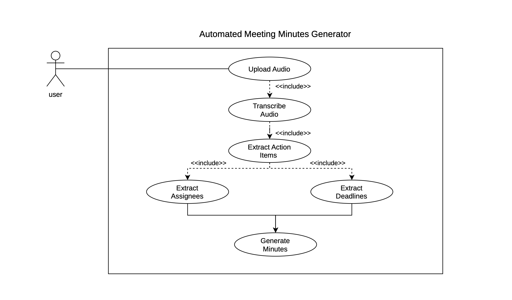
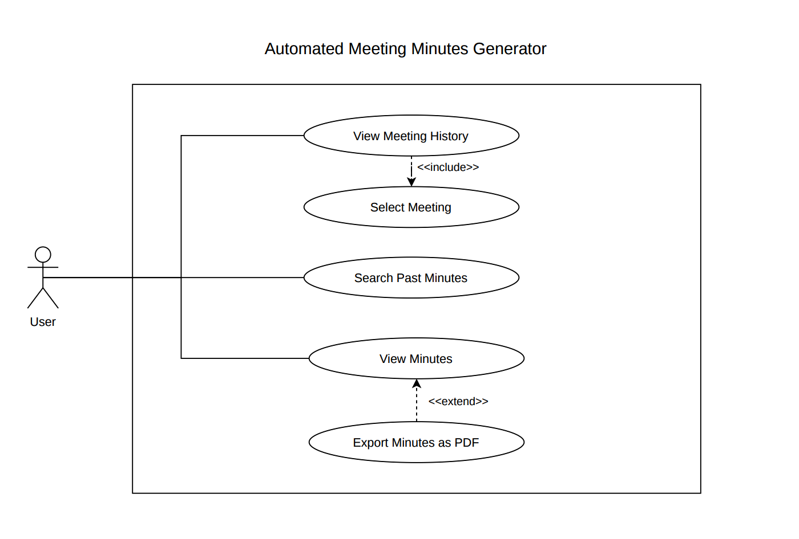

# Software Requirements Specification (SRS)

## Automated Meeting Minutes Generator

| Field | Details |
|---|---|
| **Project** | Automated Meeting Minutes Generator (MiniMax) |
| **Version** | 1.0 |
| **Date** | September 2026 |
| **Authors** | Team MiniMax |
| **Status** | Draft |

---

### Revision History

| Version | Date | Author | Change Summary |
|---|---|---|---|
| 0.1 | DD-MM-2026 | Member 1 | Initial draft — Introduction & Overall Description |
| 0.2 | DD-MM-2026 | Member 2 | Functional requirements added |
| 0.3 | DD-MM-2026 | Member 3 | Use case diagrams and external interfaces |
| 0.4 | DD-MM-2026 | Member 4 | Non-functional, security requirements |
| 1.0 | DD-MM-2026 | All | Final reviewed version |

### Approvals

| Role | Name | Signature / Email | Date |
|---|---|---|---|
| Course Coordinator | | | |

---

## Table of Contents

1. Introduction
2. Overall Description
3. External Interface Requirements
4. System Features (Functional Requirements — Detailed)
5. Non-Functional Requirements (Detailed)
6. Quality Attributes & Acceptance Tests
7. System Models and Diagrams (UML Use Cases)
8. Requirements Traceability Matrix (RTM)

---

## 1. Introduction

### 1.1 Purpose

This document is a Software Requirements Specification (SRS) for the **Automated Meeting Minutes Generator** system. It defines the functional and non-functional requirements, external interfaces, security requirements, and verification criteria for the system. This document is intended for use by the development team, QA engineers, and course instructors as the authoritative reference for what the system shall do.

### 1.2 Scope

The Automated Meeting Minutes Generator is a web-based tool that allows users to:

- Upload meeting audio recordings
- Transcribe audio to text (via a stub/simulated transcription engine)
- Extract action items, deadlines, assignees, and key decisions using keyword pattern matching
- Generate structured meeting minutes documents in Markdown and PDF formats
- Store, browse, and search past meeting minutes

**In Scope:**
- Audio file upload and validation
- Stub transcription (simulated audio-to-text conversion)
- Text processing pipeline (keyword/pattern-based extraction)
- Templated document generation (Markdown + PDF export)
- User authentication and meeting history management
- Web-based user interface

**Out of Scope:**
- Real-time/live meeting transcription
- Real speech recognition / ASR model training
- Mobile application
- Integration with third-party calendar or video conferencing tools (Zoom, Teams, etc.)
- Multi-language transcription support

### 1.3 Audience

- **Developers** — to understand what to build
- **QA Engineers** — to derive test cases from requirements
- **Course Instructors** — to evaluate completeness and SE process adherence
- **Project Manager / Team Lead** — to track scope and plan sprints

### 1.4 Definitions, Acronyms, and Abbreviations

| Term | Definition |
|---|---|
| **Transcription** | The process of converting spoken audio into written text |
| **Stub** | A simplified placeholder implementation that simulates real functionality |
| **Action Item** | A task or follow-up identified during a meeting, assigned to a person with an optional deadline |
| **NLP** | Natural Language Processing — techniques for analyzing and processing text |
| **Keyword Pattern** | A predefined word or phrase (e.g., "TODO", "action:", "assigned to") used to identify action items |
| **Meeting Minutes** | A structured summary document of a meeting including attendees, discussion points, decisions, and action items |
| **SRS** | Software Requirements Specification |
| **SAD** | Software Architecture and Design Document |
| **STP** | Software Test Plan |
| **RTM** | Requirements Traceability Matrix |
| **API** | Application Programming Interface |
| **REST** | Representational State Transfer |
| **PDF** | Portable Document Format |
| **MIME** | Multipurpose Internet Mail Extensions |
| **TLS** | Transport Layer Security |
| **UI** | User Interface |

---

## 2. Overall Description

### 2.1 Product Perspective

The Automated Meeting Minutes Generator is a standalone web application. It consists of:

- **Web Frontend** — a browser-based interface for uploading audio, viewing minutes, and browsing history
- **Backend API** — a Python-based server handling file uploads, processing pipeline orchestration, and data persistence
- **Processing Pipeline** — three sequential modules: Transcription (stub), Text Extraction, and Document Generation
- **Data Store** — a relational database (SQLite) for storing meeting metadata, minutes, and user accounts

The system operates independently and does not integrate with external meeting platforms or real speech recognition services. The transcription module uses a stub implementation that returns pre-defined or simulated text output.

### 2.2 Major Product Functions

1. **Audio Upload & Validation** — Accept audio files (MP3, WAV, M4A), validate format and size
2. **Audio Transcription (Stub)** — Convert uploaded audio to text using a simulated transcription engine
3. **Action Item Extraction** — Parse transcribed text to identify action items, deadlines, and assignees using keyword patterns and regex
4. **Decision & Discussion Extraction** — Identify key decisions and discussion points from text
5. **Meeting Minutes Generation** — Assemble extracted data into a structured Markdown document using templates
6. **PDF Export** — Convert generated minutes to downloadable PDF
7. **Meeting History & Search** — Store, list, browse, and search past meeting minutes
8. **User Authentication** — Register, login, and manage user sessions
9. **Action Item Editing** — Allow users to manually edit/correct extracted action items before finalizing

### 2.3 User Roles and Characteristics

| Role | Description | Characteristics |
|---|---|---|
| **Meeting Organizer** | Primary user who uploads audio and generates minutes | Basic computer literacy, expects intuitive upload-and-generate workflow, needs fast turnaround |
| **Team Member / Viewer** | Views generated minutes and assigned action items | Needs clear, readable output; may search past meetings |
| **System Administrator** | Manages user accounts and system configuration | Technical background, needs access to logs and system settings |

### 2.4 Operating Environment

- **Server:** Python 3.10+, Flask/FastAPI framework, running on any standard OS (Windows/Linux/macOS)
- **Client:** Modern web browsers (Chrome 90+, Firefox 90+, Edge 90+)
- **Database:** SQLite (development), PostgreSQL (optional for production)
- **Deployment:** Local development server; optionally Docker-containerized

### 2.5 Constraints

- Transcription module is a **stub** — it does not perform real speech recognition
- Audio file size limited to **100 MB**
- System designed for **single-tenant** use (one team/organization)
- No real-time streaming — audio must be uploaded as a complete file
- Must use open-source libraries only

### 2.6 Assumptions and Dependencies

- Users will upload reasonably clean audio files
- The stub transcription module will return realistic sample text for demonstration
- Users have access to a modern web browser with JavaScript enabled
- Python 3.10+ and pip are available on the deployment machine

---

## 3. External Interface Requirements

### 3.1 User Interfaces

The system provides a web-based UI with the following pages:

| Page | Description |
|---|---|
| **Home Page** | Allows the user to upload a meeting audio file and start processing. |
| **History Page** | Displays previously processed meetings and allows the user to select a meeting. |
| **Minutes Viewer** | Displays the generated meeting minutes, including extracted action items, assignees, and deadlines. |
| **PDF Export** | Allows the user to export the generated meeting minutes as a PDF. |

**UI Requirements:**
-Clear navigation between Home and History pages.
- Simple and intuitive controls for uploading and processing audio.
- Clear display of generated meeting minutes.
- Appropriate error messages for invalid or unsupported audio files.
- Accessible and readable interface.

### 3.2 Hardware Interfaces

No specialized hardware required. The system operates entirely through web browsers and standard server hardware.

### 3.3 Software Interfaces

| Interface | Description | Protocol |
|---|---|---|
| **Backend REST API** | Frontend communicates with backend via RESTful API endpoints | HTTP/HTTPS (JSON payloads) |
| **SQLite / PostgreSQL** | Backend reads/writes meeting data, user accounts | SQL via ORM (SQLAlchemy) |
| **File System** | Uploaded audio files and generated PDFs stored on server disk | Local filesystem I/O |
| **Jinja2 Template Engine** | Backend renders Markdown minutes from templates | Python library call |
| **WeasyPrint** | Backend converts HTML/Markdown to PDF | Python library call |

### 3.4 Communication Interfaces

- All client-server communication over **HTTP** (development) or **HTTPS with TLS 1.2+** (production)
- RESTful API with JSON request/response bodies
- File uploads via **multipart/form-data** POST requests
- No real-time WebSocket connections required (processing is request-response based)

---

## 4. System Features (Functional Requirements — Detailed)

> Note: Each requirement includes acceptance criteria and a test case reference. IDs follow the format `MM-F-###`.

### 4.1 Audio Upload & Validation

Description: Allow users to upload meeting audio files with metadata. Validate file format, MIME type, and size before accepting.

Req ID | Requirement (The system shall…) | Type | Priority | Source | Acceptance Criteria / Test Ref | Dependencies
--- | --- | --- | --- | --- | --- | ---
MM-F-001 | Accept audio file uploads in MP3, WAV, and M4A formats via the web interface | Functional | High | User | AC: Upload succeeds for valid MP3/WAV/M4A files. Test: TC-UP-01 | File system storage
MM-F-002 | Validate uploaded file format and MIME type and reject unsupported or non-audio files with a clear error message | Functional | High | Security | AC: Non-audio or unsupported files are rejected and are not passed to the processing pipeline. Test: TC-UP-02 | MIME type library
MM-F-003 | Reject files exceeding 100 MB with an appropriate error message | Functional | Medium | Performance | AC: Files greater than 100 MB are rejected and are not processed. Test: TC-UP-03 | Server config

### 4.2 Transcription

Description: Convert uploaded audio to text using the configured stub transcription module and display processing status to the user.

Req ID | Requirement (The system shall…) | Type | Priority | Source | Acceptance Criteria / Test Ref | Dependencies
--- | --- | --- | --- | --- | --- | ---
MM-F-004 | Convert an accepted meeting audio file into a textual transcript using the configured stub transcription engine | Functional | High | Core | AC: Given a valid uploaded audio file, the transcription module returns a non-empty transcript associated with the meeting. Test: TC-TR-01 | Stub module
MM-F-005 | Display the processing state to the user while transcription and subsequent text processing are being performed | Functional | Medium | UX | AC: User sees a processing state while the pipeline is running and a completion or error state when processing finishes. Test: TC-TR-02 | Frontend + processing pipeline

### 4.3 Text Preprocessing

Description: Prepare the generated transcript for reliable information extraction while preserving its semantic content.

Req ID | Requirement (The system shall…) | Type | Priority | Source | Acceptance Criteria / Test Ref | Dependencies
--- | --- | --- | --- | --- | --- | ---
MM-F-018 | Normalize the transcribed text before information extraction by handling unnecessary whitespace, line breaks, and case variations where appropriate without changing the semantic content | Functional | High | Core | AC: Equivalent transcripts with inconsistent whitespace, line breaks, or capitalization produce a normalized representation suitable for extraction while preserving their meaning. Test: TC-TP-01 | Text processing module

### 4.4 Action Item & Information Extraction

Description: Parse the processed transcript to extract action items, deadlines, assignees, key decisions, and discussion points using predefined keyword patterns and regular expressions.

Req ID | Requirement (The system shall…) | Type | Priority | Source | Acceptance Criteria / Test Ref | Dependencies
--- | --- | --- | --- | --- | --- | ---
MM-F-006 | Identify action items from the processed transcript using predefined task indicators and action-oriented patterns such as "action:", "TODO", "task:", "need to", "will", "assigned to", "follow up", and "responsible for" | Functional | High | Core | AC: Given a transcript containing explicit task statements, each applicable task is identified as a separate action item. A sentence shall not be classified as an action item solely because it contains a common keyword without an actionable context. Test: TC-EX-01 | Text preprocessing + ExtractorModule
MM-F-007 | Associate recognizable deadline expressions with the relevant action item, including expressions such as "by Friday", "due on 15 September", "before next Monday", and "within two weeks" | Functional | High | Core | AC: When an action item contains or is directly associated with a recognizable deadline expression, the deadline is stored with that action item. When no deadline is present, the deadline remains empty rather than being fabricated. Test: TC-EX-02 | Date parser + ExtractorModule
MM-F-008 | Identify the assignee associated with an action item using assignment patterns such as "assigned to John", "John will handle", "Alice is responsible for", and "Rahul needs to" | Functional | High | Core | AC: Given an action item with an identifiable assignee, the person's name is associated with that action item. When no assignee can be identified, the assignee remains empty or is marked "Unassigned". Test: TC-EX-03 | NLP / regex
MM-F-009 | Identify explicit decision statements from the processed transcript using decision patterns such as "decided", "agreed", "approved", "resolved", and "it was decided that" | Functional | Medium | Core | AC: Given a transcript containing explicit decision statements, the system extracts and stores the decision separately from action items and general discussion. Test: TC-EX-04 | Regex module
MM-F-019 | Identify and extract key discussion points from the processed transcript and store them separately from action items and decisions | Functional | Medium | Core | AC: Given transcript segments containing discussion topics, the system produces one or more discussion-point entries without incorrectly classifying explicit decisions or action items as discussion points. Test: TC-EX-05 | ExtractorModule
MM-F-020 | Return a valid empty extraction result when no action items, deadlines, assignees, decisions, or discussion points can be identified instead of generating unsupported information | Functional | High | Reliability | AC: Given a transcript containing no recognizable extractable information, the extraction process completes successfully and returns empty collections for unavailable categories. Test: TC-EX-06 | ExtractorModule

### 4.5 Document Generation

Description: Assemble extracted information into a structured meeting minutes document using templates and provide PDF export.

Req ID | Requirement (The system shall…) | Type | Priority | Source | Acceptance Criteria / Test Ref | Dependencies
--- | --- | --- | --- | --- | --- | ---
MM-F-010 | Generate a structured meeting minutes document in Markdown format containing title, date, participants, summary, discussion points, decisions, and action items | Functional | High | Core | AC: Generated Markdown contains all required sections with the corresponding meeting data. Test: TC-GEN-01 | Jinja2 templates
MM-F-011 | Export the generated meeting minutes as a downloadable PDF file | Functional | High | User | AC: User selects "Export PDF" and receives a valid, readable, formatted PDF containing the current meeting minutes. Test: TC-GEN-02 | WeasyPrint
MM-F-012 | Allow users to edit extracted action items including action text, assignee, and deadline before finalizing the minutes | Functional | Medium | User | AC: User can modify an action-item field, save the change, and observe the updated value in the final meeting minutes. Test: TC-GEN-03 | Frontend + API

### 4.6 Meeting History & Search

Description: Store meeting minutes persistently and allow users to browse and search past meetings.

Req ID | Requirement (The system shall…) | Type | Priority | Source | Acceptance Criteria / Test Ref | Dependencies
--- | --- | --- | --- | --- | --- | ---
MM-F-013 | Store meeting minutes with metadata including title, date, participants, and creation timestamp in the database | Functional | High | Core | AC: After successful generation, the meeting record and its minutes are stored and can be retrieved later. Test: TC-HIST-01 | SQLite / ORM
MM-F-014 | Display a history page listing past meeting minutes sorted by date with the newest meetings first | Functional | Medium | User | AC: History page displays previously generated meetings and allows the user to open an individual meeting record. Test: TC-HIST-02 | Frontend + API
MM-F-015 | Allow users to search past meeting minutes by keyword or date range | Functional | Medium | User | AC: Search returns meetings matching the supplied criteria; when no meetings match, an appropriate no-results message is displayed. Test: TC-HIST-03 | DB query

### 4.7 User Authentication & Meeting Setup

Description: Allow users to register, log in, and configure meeting metadata before processing.

Req ID | Requirement (The system shall…) | Type | Priority | Source | Acceptance Criteria / Test Ref | Dependencies
--- | --- | --- | --- | --- | --- | ---
MM-F-016 | Allow users to register with an email address and password and log in using valid credentials | Functional | High | Security | AC: Valid registration creates an account; valid credentials grant access; invalid credentials are rejected with an appropriate error. Test: TC-AUTH-01 | Auth module
MM-F-017 | Allow users to input meeting title, date, and participant names before or during audio upload | Functional | Medium | User | AC: Supplied meeting metadata is validated and stored with the corresponding meeting record. Test: TC-AUTH-02 | Frontend form

---

## 5. Non-Functional Requirements (Detailed)

> IDs follow the format `MM-NF-###`. Each NFR is measurable and tied to a test plan.

| Req ID | Requirement | Category | Priority | Acceptance Criteria / Measurement |
|---|---|---|---|---|
| MM-NF-001 | The system shall process a 30-minute audio stub and generate minutes within 60 seconds | Performance | High | 90th percentile processing time ≤ 60s in test. Test: TC-PERF-01 |
| MM-NF-002 | The web UI shall be responsive and usable on desktop browsers with minimum resolution 1024×768 | Usability | Medium | UI renders correctly on Chrome, Firefox, and Edge at 1024px. Test: TC-UX-01 |
| MM-NF-003 | The system shall support at least 5 concurrent users uploading and processing simultaneously | Scalability | Medium | Load test with 5 concurrent uploads completes without errors. Test: TC-PERF-02 |
| MM-NF-004 | All user passwords shall be hashed using bcrypt with salt and never stored in plaintext | Security | High | Database audit confirms no plaintext passwords. Test: TC-SEC-01 |
| MM-NF-005 | The system shall be available and functional during the scheduled demo/evaluation session, with no unplanned downtime | Reliability | Medium | System is accessible and responsive throughout the demo. Test: Manual verification during demo |
| MM-NF-006 | System logs shall include timestamped events for all uploads, processing, and errors | Auditability | Medium | Log files contain structured entries with ISO timestamps. Test: TC-OPS-01 |

### 5.1 Security

#### 5.1.1 Security Objectives

1. **Protect User Credentials** — Ensure that user passwords, session tokens, and authentication data are securely stored and transmitted, preventing unauthorized access to user accounts.

2. **Protect User Data Privacy** — Ensure that uploaded audio files and generated meeting minutes are accessible only to the authenticated user who created them, preventing unauthorized data exposure.

#### 5.1.2 Security Requirements

| Req ID | Requirement (The system shall…) | Type | Priority | Acceptance Criteria / Test Ref |
|---|---|---|---|---|
| MM-SR-001 | Enforce HTTPS (TLS 1.2+) for all client-server communications in production | Security | High | All API calls use HTTPS; HTTP requests are redirected. Test: TC-SEC-02 |
| MM-SR-002 | Hash all user passwords using bcrypt with a minimum cost factor of 10 | Security | High | Passwords in DB are bcrypt hashes. Test: TC-SEC-03 |
| MM-SR-003 | Implement session timeout — automatically log out users after 30 minutes of inactivity | Security | Medium | Session expires after 30 min idle; user is redirected to login. Test: TC-SEC-04 |
| MM-SR-004 | Validate and sanitize all user inputs on the server side to prevent SQL injection and XSS attacks | Security | High | Injection payloads in input fields are neutralized. Test: TC-SEC-05 |
| MM-SR-005 | Restrict file uploads to allowed audio MIME types only (audio/mpeg, audio/wav, audio/x-m4a) and reject all others | Security | High | Uploading non-audio files returns 400 error. Test: TC-SEC-06 |
| MM-SR-006 | Ensure uploaded audio files are stored with unique generated filenames (not user-provided) to prevent path traversal attacks | Security | Medium | Files stored with UUID names; original filename stored in DB only. Test: TC-SEC-07 |

---

## 6. Quality Attributes & Acceptance Tests

### 6.1 Exit Criteria for Acceptance

- All **High-priority** functional requirements (MM-F-001 through MM-F-016) are implemented and verified
- All **High-priority** non-functional requirements pass their acceptance criteria
- All **High-priority** security requirements pass their acceptance criteria
- No **Critical** or **High** severity defects remain open
- RTM shows all planned test cases executed with pass status

### 6.2 Acceptance Test Suites

| Suite | Covers | Key Test Cases |
|---|---|---|
| **Upload Tests** | MM-F-001, MM-F-002, MM-F-003 | Valid upload, invalid format rejection, oversized file rejection |
| **Transcription Tests** | MM-F-004, MM-F-005 | Stub returns text, progress indicator shown |
| **Extraction Tests** | MM-F-006, MM-F-007, MM-F-008, MM-F-009 | Action items, deadlines, assignees, decisions extracted correctly |
| **Generation Tests** | MM-F-010, MM-F-011, MM-F-012 | Markdown structure, PDF download, editable fields |
| **History & Search Tests** | MM-F-013, MM-F-014, MM-F-015 | Data persisted, list displays, search returns results |
| **Authentication Tests** | MM-F-016, MM-F-017 | Register, login, invalid credentials, meeting metadata |
| **Performance Tests** | MM-NF-001, MM-NF-003 | Processing time, concurrent users |
| **Security Tests** | MM-SR-001 through MM-SR-006 | HTTPS, hashing, session timeout, injection, MIME validation |

---

## 7. System Models and Diagrams

### 7.1 UML Use-Case Diagram – Meeting Minutes System

The use-case diagram illustrates the main interactions between the user
and the Automated Meeting Minutes Generator.

> **Actors:** User

**Use Case Descriptions:**

| Use Case | Actor | Precondition | Main Flow | Postcondition |
|---|---|---|---|---|
| **Upload Audio** | User | User is on the home page | 1. User selects an audio file. 2. System validates the file. 3. User starts the upload and processing. | Audio file is uploaded and ready for processing. |
| **Transcribe Audio** | System | Audio file has been uploaded | 1. System processes the audio. 2. System converts the speech into text. | Meeting audio is converted into text. |
| **Extract Action Items** | System | Transcription is available | 1. System analyzes the transcription. 2. System identifies action items. 3. System extracts related information. | Action items are identified from the meeting. |
| **Extract Assignees** | System | Action items have been identified | 1. System analyzes the extracted action items. 2. System identifies the person assigned to each item. | Assignees are associated with action items where available. |
| **Extract Deadlines** | System | Action items have been identified | 1. System analyzes the meeting text. 2. System identifies mentioned deadlines. | Deadlines are associated with relevant action items where available. |
| **Generate Minutes** | System | Required meeting information has been extracted | 1. System organizes the extracted information. 2. System formats it into meeting minutes. | Structured meeting minutes are generated. |
| **View Meeting History** | User | Previous meetings exist | 1. User opens the History section. 2. System displays previous meetings. | User can view available meeting records. |
| **Select Meeting** | User | Meeting history is displayed | 1. User selects a meeting. 2. System retrieves the selected meeting. | Selected meeting details are displayed. |
| **Search Past Minutes** | User | Past meeting records exist | 1. User enters a search term. 2. System searches stored meeting records. 3. Matching meetings are displayed. | Relevant past meetings are displayed. |
| **View Minutes** | User | Meeting minutes are available | 1. User selects a meeting. 2. System displays its generated minutes. | User can read the meeting minutes. |
| **Export Minutes as PDF** | User | Meeting minutes are displayed | 1. User selects the export option. 2. System converts the minutes into PDF format. 3. System provides the PDF for download. | PDF version of the meeting minutes is available. |

### 7.2 UML Use-Case Diagram 2 — – Meeting History and Minutes

The use-case diagram represents how the User accesses previous meeting records, searches past minutes, views selected meeting minutes, and exports the minutes as a PDF.

**Actor:** User

**Use Case Descriptions:**

| Use Case | Actor | Precondition | Main Flow | Postcondition |
|---|---|---|---|---|
| **View Meeting History** | User | Previous meeting records are available | 1. User opens the meeting history. 2. System displays the available past meetings. 3. User can select a meeting. | Meeting history is displayed to the user. |
| **Select Meeting** | User | Meeting history is displayed | 1. User selects a meeting from the history. 2. System retrieves the selected meeting details. | The selected meeting is available for viewing. |
| **Search Past Minutes** | User | Previous meeting records are available | 1. User enters a search term. 2. System searches the stored meeting records. 3. System displays matching results. | Matching past meetings are displayed. |
| **View Minutes** | User | A meeting has been selected and minutes are available | 1. User opens the selected meeting. 2. System retrieves the generated minutes. 3. System displays the minutes. | User can view the selected meeting minutes. |
| **Export Minutes as PDF** | User | Meeting minutes are being viewed | 1. User selects the export option. 2. System converts the minutes into PDF format. 3. System provides the PDF for download. | The meeting minutes are available as a PDF. |

---

## 8. Requirements Traceability Matrix (RTM)

Req ID | Requirement (Short) | Section Ref | Module | Test Case(s) | Status (N/P/A) | Comments
--- | --- | --- | --- | --- | --- | ---
MM-F-001 | Upload audio files (MP3, WAV, M4A) | 4.1 | UploadModule | TC-UP-01 | N |
MM-F-002 | Validate file format and MIME type | 4.1 | UploadModule | TC-UP-02 | N | Reject unsupported/non-audio files
MM-F-003 | Reject files > 100 MB | 4.1 | UploadModule | TC-UP-03 | N | File-size validation
MM-F-004 | Transcribe audio using stub engine | 4.2 | TranscriptionModule | TC-TR-01 | N | Stub transcription
MM-F-005 | Display processing status | 4.2 | Frontend + Processing Pipeline | TC-TR-02 | N | Transcription and extraction status
MM-F-006 | Extract action items | 4.4 | ExtractorModule | TC-EX-01 | N | Pattern/context-based extraction
MM-F-007 | Associate deadlines with action items | 4.4 | ExtractorModule | TC-EX-02 | N | Deadline/date expression parsing
MM-F-008 | Extract action-item assignees | 4.4 | ExtractorModule | TC-EX-03 | N | Assignment/name extraction
MM-F-009 | Extract key decisions | 4.4 | ExtractorModule | TC-EX-04 | N | Decision-pattern extraction
MM-F-010 | Generate Markdown meeting minutes | 4.5 | GeneratorModule | TC-GEN-01 | N | Template-based generation
MM-F-011 | Export meeting minutes as PDF | 4.5 | GeneratorModule | TC-GEN-02 | N | PDF generation and download
MM-F-012 | Edit action-item fields | 4.5 | Frontend + API | TC-GEN-03 | N | User correction before finalization
MM-F-013 | Store minutes with metadata | 4.6 | DatabaseModule | TC-HIST-01 | N | Persistent meeting storage
MM-F-014 | Display meeting history | 4.6 | Frontend + API | TC-HIST-02 | N | Newest-first history
MM-F-015 | Search past meeting minutes | 4.6 | Frontend + API | TC-HIST-03 | N | Keyword/date search
MM-F-016 | User registration and login | 4.7 | AuthModule | TC-AUTH-01 | N | Registration and authentication
MM-F-017 | Input meeting metadata | 4.7 | Frontend + Database | TC-AUTH-02 | N | Title/date/participants
MM-F-018 | Preprocess and normalize transcript | 4.3 | TextProcessingModule | TC-TP-01 | N | Normalize transcript before extraction
MM-F-019 | Extract key discussion points | 4.4 | ExtractorModule | TC-EX-05 | N | Discussion/topic extraction
MM-F-020 | Handle empty extraction results | 4.4 | ExtractorModule | TC-EX-06 | N | No unsupported information generated

MM-NF-001 | Processing time ≤ 60s | 5 | Pipeline | TC-PERF-01 | N |
MM-NF-002 | Responsive UI on desktop | 5 | Frontend | TC-UX-01 | N |
MM-NF-003 | 5 concurrent users | Section 5 | Server | TC-PERF-02 | N |
MM-NF-004 | Passwords hashed (bcrypt) | 5 | AuthModule | TC-SEC-01 | N |
MM-NF-005 | Availability during scheduled evaluation/demo | Section 5 | Infrastructure | Ops monitoring | N |
MM-NF-006 | Timestamped logs | 5 | Server | TC-OPS-01 | N |
MM-SR-001 | HTTPS / TLS 1.2+ | 5.1.2 | Server | TC-SEC-02 | N |
MM-SR-002 | bcrypt password hashing | 5.1.2 | AuthModule | TC-SEC-03 | N |
MM-SR-003 | 30-min session timeout | 5.1.2 | AuthModule | TC-SEC-04 | N |
MM-SR-004 | Input sanitization (SQLi, XSS) | 5.1.2 | Server | TC-SEC-05 | N |
MM-SR-005 | MIME type restriction on uploads | 5.1.2 | UploadModule | TC-SEC-06 | N |
MM-SR-006 | UUID filenames (path traversal prevention) | 5.1.2 | UploadModule | TC-SEC-07 | N |

> Status Key: N = Not started, P = Partial, A = Approved/Passed
---

*End of SRS Document — Version 1.0*
