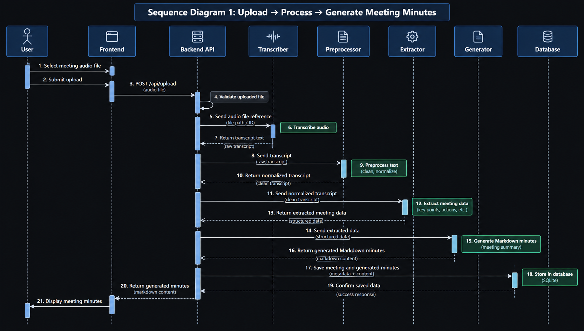
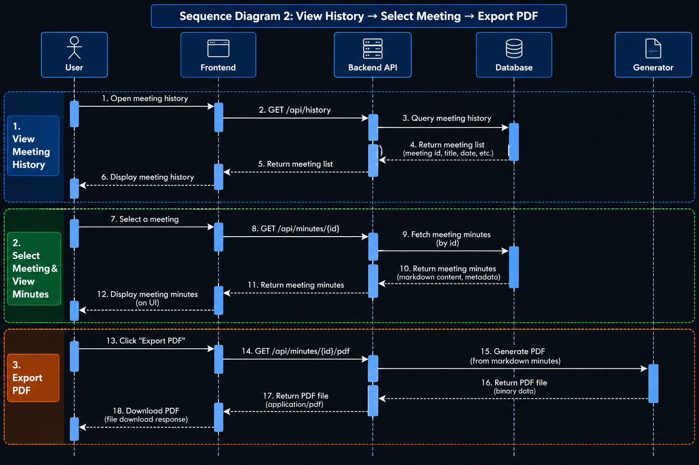
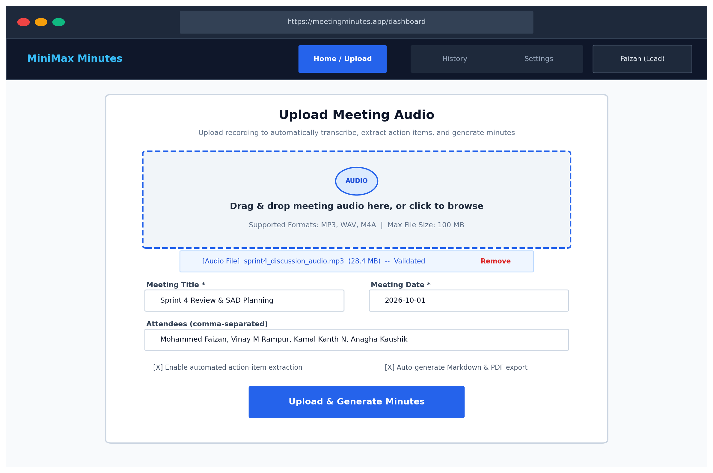
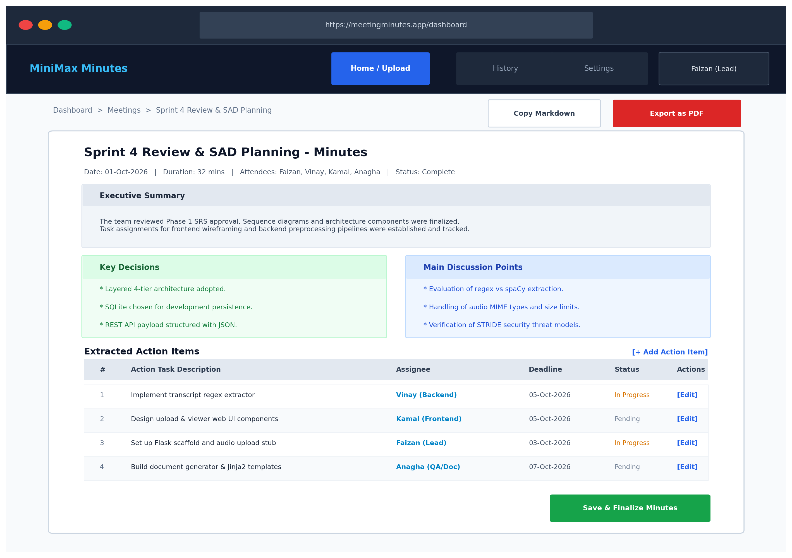
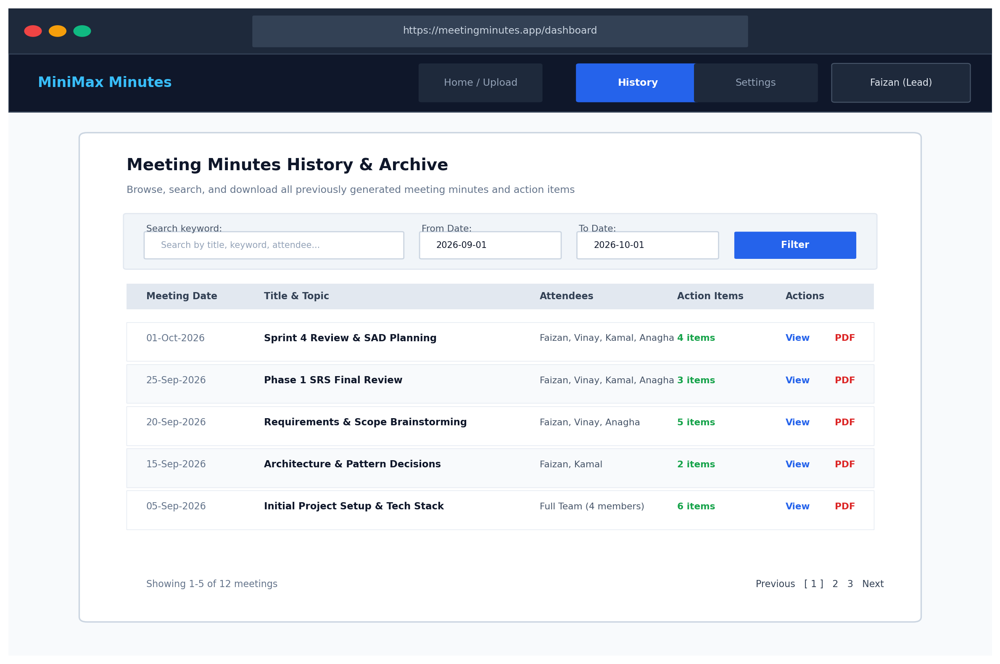

# 🧑‍🤝‍🧑 Team Guide — Phase 2: SAD Document

## For: All 4 Team Members

The SAD document (both `.md` and `.docx`) is already **pre-filled** at `docs/SAD.md` and `docs/SAD.docx`. Your job is to **review, refine, and add the diagrams**.

---

## 🔧 First Step (Everyone)

```bash
git pull origin main
```

Open `docs/SAD.md` and read through it to understand the full architecture.

---

## 👥 Who Does What

---

### 📌 Mohammed Faizan (Team Lead)

**Sections:** 1 (Introduction), 2 (Document Overview), 3.1 (Goals), 3.5 (Architecture Pattern), Final Review

**Tasks:**

1. **Review Section 1 (Introduction)**
   - Verify purpose, scope, audience are accurate
   - Add/remove definitions in Section 1.4 if needed

2. **Review Section 3.1 (Goals & Constraints)**
   - Confirm the goals match your team's vision
   - Add any course-specific constraints (e.g., submission deadline, tools required by instructor)

3. **Review Section 3.5 (Architecture Pattern)**
   - Confirm "Layered Architecture" is what your team wants
   - If your team prefers a different pattern, update the rationale

4. **Review Section 3.7 (Risks & Mitigations)**
   - Add any real risks your team is facing (e.g., time constraints, learning curve)

5. **Fill Revision History** — Replace `DD-MM-2026` with actual dates as each member pushes

6. **Final Review** — After all members push, read the entire SAD for consistency

**Commit:**
```bash
git add docs/SAD.md
git commit -m "docs(SAD): Faizan - reviewed intro, goals, architecture pattern"
git push origin main
```

---

### 📌 Kamal Kanth N

**Sections:** 4.2 (Sequence Diagrams), 4.3 (API Design)

**Tasks:**

1. **Create 2 UML Sequence Diagrams** (this is your MAIN task)
   - Open [draw.io](https://app.diagrams.net/) (free)
   - **Diagram 1:** Upload → Process → Generate flow
     - Actors: User, Frontend, Backend API, Transcriber, Preprocessor, Extractor, Generator, Database
     - Show the full request-response flow step by step
   - **Diagram 2:** View History → Select Meeting → Export PDF flow
     - Actors: User, Frontend, Backend API, Database, Generator
   - Export as **PNG images**
   - Save them:
     ```
     docs/diagrams/sequence_upload_process.png
     docs/diagrams/sequence_history_export.png
     ```
   - Update Section 4.2 in `SAD.md` to reference the images:
     ```markdown
     
     
     ```
   - Remove the text-based sequence diagrams and replace with image references

2. **Review Section 4.3 (API Design)**
   - Check all 10 REST endpoints — do they make sense?
   - Verify request/response formats
   - Add any missing endpoints your team might need
   - Review the error response format

**Commit:**
```bash
git add docs/SAD.md docs/diagrams/
git commit -m "docs(SAD): Kamal - added sequence diagrams, reviewed API design"
git push origin main
```

---

### 📌 Vinay M Rampur

**Sections:** 4.5 (UX Design), 3.4 (Component Descriptions)

**Tasks:**

1. **Create UI Wireframes/Mockups** (this is your MAIN task)
   - Use [Figma](https://figma.com) (free), [draw.io](https://app.diagrams.net/), or any design tool
   - Create mockups for these 3 pages:
     - **Home Page** — Upload form with drag-and-drop area, meeting metadata fields, Upload button
     - **Minutes Viewer** — Minutes display with sections (summary, discussion, decisions, action items table), Edit buttons, Export PDF button
     - **History Page** — Search bar, date filters, paginated meeting list, View buttons
   - Export as **PNG images**
   - Save them:
     ```
     docs/diagrams/wireframe_home.png
     docs/diagrams/wireframe_minutes_viewer.png
     docs/diagrams/wireframe_history.png
     ```
   - Update Section 4.5 in `SAD.md` to reference the images:
     ```markdown
     
     
     
     ```

2. **Review Section 3.4 (Component Descriptions)**
   - Verify the frontend components make sense
   - Add any components you think are missing

**Commit:**
```bash
git add docs/SAD.md docs/diagrams/
git commit -m "docs(SAD): Vinay - added UI wireframes, reviewed component descriptions"
git push origin main
```

---

### 📌 Anagha Kaushik

**Sections:** 3.3 (Component Diagram), 3.9 (Security/STRIDE), 4.4 (Error Handling), 4.6 (Database Design)

**Tasks:**

1. **Create UML Component Diagram** (important!)
   - Open [draw.io](https://app.diagrams.net/)
   - Draw the 4-layer architecture showing all components:
     - **Presentation Layer:** Upload Page, Minutes Viewer, History Page
     - **API Layer:** Flask Server with route groups (/upload, /minutes, /auth, /history)
     - **Processing Layer:** Transcription → Preprocessor → Extractor → Generator
     - **Data Layer:** SQLite DB, File System
   - Show arrows for data flow between layers
   - Export as PNG:
     ```
     docs/diagrams/component_diagram.png
     ```
   - Update Section 3.3 in `SAD.md`:
     ```markdown
     
     ```

2. **Create ER Diagram**
   - Draw the 3 tables (users, meetings, action_items) with relationships
   - Show: `users 1:N meetings`, `meetings 1:N action_items`
   - Include column names, types, and PK/FK
   - Export as PNG:
     ```
     docs/diagrams/er_diagram.png
     ```
   - Update Section 4.6 in `SAD.md`

3. **Review Section 3.9 (STRIDE Threat Model)**
   - Check all 6 threats — are they realistic for your project?
   - Verify the mitigations are achievable
   - Add any threats you can think of

4. **Review Section 4.4 (Error Handling & Logging)**
   - Verify the logging format and rules

**Commit:**
```bash
git add docs/SAD.md docs/diagrams/
git commit -m "docs(SAD): Anagha - added component diagram, ER diagram, reviewed STRIDE"
git push origin main
```

---

## 📅 Timeline

| Day | Action |
|---|---|
| **Day 1** | Everyone pulls repo, reads SAD, understands their sections |
| **Day 2-3** | Each member creates their diagrams + reviews their sections |
| **Day 4** | Everyone pushes their changes |
| **Day 5** | **Faizan** does final review, fills revision dates, marks as Complete |
| **Day 5** | Regenerate `SAD.docx` with diagrams → Phase 2 DONE |

---

## 📊 Diagram Checklist

| Diagram | Owner | Tool | Save As |
|---|---|---|---|
| UML Component Diagram | Anagha | draw.io | `docs/diagrams/component_diagram.png` |
| ER Diagram | Anagha | draw.io | `docs/diagrams/er_diagram.png` |
| Sequence Diagram 1 (Upload flow) | Kamal | draw.io | `docs/diagrams/sequence_upload_process.png` |
| Sequence Diagram 2 (History flow) | Kamal | draw.io | `docs/diagrams/sequence_history_export.png` |
| Wireframe: Home Page | Vinay | Figma/draw.io | `docs/diagrams/wireframe_home.png` |
| Wireframe: Minutes Viewer | Vinay | Figma/draw.io | `docs/diagrams/wireframe_minutes_viewer.png` |
| Wireframe: History Page | Vinay | Figma/draw.io | `docs/diagrams/wireframe_history.png` |

---

## ⚠️ Git Workflow (Same as SRS Phase)

```bash
# BEFORE editing
git pull origin main

# AFTER editing
git add docs/SAD.md docs/diagrams/
git commit -m "docs(SAD): <your-name> - <what you did>"
git pull origin main
# resolve conflicts if any
git push origin main
```

---

## ✅ Phase 2 Completion Criteria

- [ ] Component diagram (proper UML image)
- [ ] ER diagram (proper image)
- [ ] 2 Sequence diagrams (proper UML images)
- [ ] 3 UI wireframes (proper images)
- [ ] All text sections reviewed and finalized
- [ ] Revision history filled with real names and dates
- [ ] SAD.docx regenerated with all diagrams embedded
- [ ] Status changed to "Complete"
