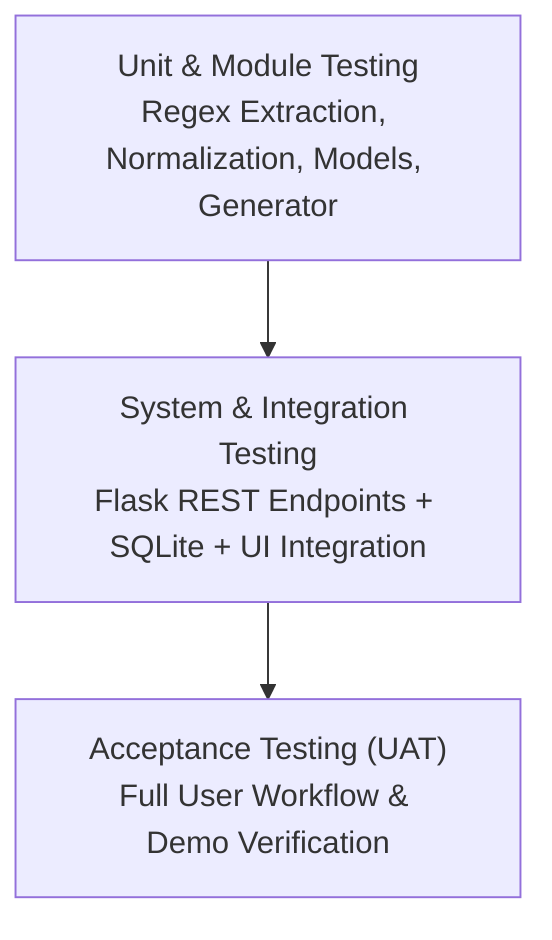

# 🧪 Software Test Plan (STP) — Automated Meeting Minutes Generator (MiniMax)

**Project:** Automated Meeting Minutes Generator (MiniMax)  
**Version:** 1.0  
**Author / QA Lead:** Anagha Kaushik (`PES1UG24AM459`)  
**Contributors:** Mohammed Faizan (`PES1UG24AM472`), Vinay M Rampur (`PES1UG24AM455`), Kamal Kanth N (`PES1UG24AM434`)  
**Date:** October 2026  
**Status:** Approved / Active Baseline  
**Course:** Software Engineering (SE) Mini-Project Deliverables  

---

## 1. Introduction

### 1.1 Purpose
This document defines the comprehensive **Software Test Plan (STP)** for the **Automated Meeting Minutes Generator (MiniMax) v1.0**. It outlines the testing objectives, scope, strategy, testing environments, schedules, test deliverables, resource allocation, and responsibilities. The plan establishes test coverage standards to verify that all functional and non-functional requirements specified in the approved **Software Requirements Specification (SRS)** and architectural components defined in the **Software Architecture Document (SAD)** are validated.

### 1.2 Scope
* **In Scope:**
  * Audio upload and format validation module (`transcriber.py`)
  * Transcription processing engine & progress reporting (`transcriber.py`)
  * Text cleaning and normalization pipeline (`preprocessor.py`)
  * Keyword and NLP pattern action item, assignee, deadline, decision, and topic extraction (`extractor.py`)
  * Templated document generation in Markdown and PDF export (`generator.py`)
  * SQLite persistence and database transactions (`models.py`)
  * REST API endpoints and error response schemas (`app.py`)
  * Frontend user interface responsiveness, drag-and-drop interaction, and history search (`index.html`, `style.css`, `app.js`)
  * Automated regression testing via GitHub Actions CI pipeline (`ci.yml`)

* **Out of Scope:**
  * Real-time acoustic model ASR training and low-level audio DSP signal processing
  * Multi-language speech translation (system scope is English speech)
  * Hardware device driver testing (standard client-server web model)
  * Third-party video conferencing integrations (Zoom, Microsoft Teams, Google Meet APIs)

### 1.3 References
1. IEEE Standard 829-2008 for Software Test Documentation
2. MiniMax Software Requirements Specification (SRS v1.0) — [`docs/SRS.md`](SRS.md)
3. MiniMax Software Architecture Document (SAD v1.0) — [`docs/SAD.md`](SAD.md)
4. MiniMax Product Backlog & Sprint Plan — [`docs/BACKLOG_AND_SPRINT_PLAN.md`](BACKLOG_AND_SPRINT_PLAN.md)

### 1.4 Definitions and Acronyms
| Term | Definition |
|---|---|
| **STP** | Software Test Plan |
| **SRS** | Software Requirements Specification |
| **SAD** | Software Architecture Document |
| **RTM** | Requirements Traceability Matrix |
| **SUT** | System Under Test |
| **CI/CD** | Continuous Integration / Continuous Deployment |
| **ASR** | Automated Speech Recognition |
| **NLP** | Natural Language Processing |
| **MIME** | Multipurpose Internet Mail Extensions |
| **UAT** | User Acceptance Testing |

---

## 2. Test Items (Modules Under Test)

The following components from `src/` constitute the Test Items for MiniMax v1.0:

1. **Audio Validation & Transcriber Module (`src/backend/transcriber.py`)**: File type validation (.mp3, .wav, .m4a), size boundary checks ($\le 100\text{ MB}$), and dialogue transcription stub.
2. **Text Preprocessor Module (`src/backend/preprocessor.py`)**: Conversational filler word removal (`um`, `uh`, `like`), whitespace collapsing, and speaker tag normalization.
3. **Information Extractor Module (`src/backend/extractor.py`)**: Regular expression and NLP pattern matching for tasks, assignees, deadlines, decisions, attendees, and executive summaries.
4. **Minutes Document Generator (`src/backend/generator.py`)**: Markdown synthesis, metadata rendering, and document export writers.
5. **Database & Storage Layer (`src/backend/models.py`)**: SQLite schema (`meetings`, `action_items`), foreign key integrity, query helpers, and state mutation.
6. **Backend REST API Server (`src/backend/app.py`)**: HTTP routes (`/api/upload`, `/api/meetings`, `/api/action-items/<id>`, `/api/meetings/<id>/export`), CORS headers, error response payloads.
7. **Frontend Web Dashboard (`src/frontend/`)**: HTML5 layout, CSS3 responsive grid/card styling, client-side AJAX file submission, upload progress simulation, minutes viewer, and meeting history search.

---

## 3. Features to be Tested

Every feature is directly traceable to the approved SRS Requirement IDs:

| Requirement ID | Feature Name | Test Category | Target Module |
|---|---|---|---|
| **MM-F-001** | Audio File Upload (MP3, WAV, M4A) | Functional | `app.py`, `transcriber.py` |
| **MM-F-002** | File Format and MIME Type Validation | Functional / Security | `transcriber.py` |
| **MM-F-003** | File Size Limit Enforcement ($\le 100\text{ MB}$) | Functional / Security | `transcriber.py`, `app.py` |
| **MM-F-004** | Speech-to-Text Transcription Generation | Functional | `transcriber.py` |
| **MM-F-005** | Pipeline Progress State Visualizer | UI / UX | `app.js`, `index.html` |
| **MM-F-006** | Action Item & Task Keyword Extraction | Functional / NLP | `extractor.py` |
| **MM-F-007** | Deadline Expression Parsing | Functional / NLP | `extractor.py` |
| **MM-F-008** | Task Assignee Identification | Functional / NLP | `extractor.py` |
| **MM-F-009** | Consensus Decision Statement Extraction | Functional / NLP | `extractor.py` |
| **MM-F-010** | Structured Markdown Minutes Generation | Functional | `generator.py` |
| **MM-F-011** | PDF Document Export Service | Functional | `generator.py`, `app.py` |
| **MM-F-012** | Action Item Status Mutation & Toggle | Functional | `app.py`, `models.py` |
| **MM-F-013** | Persistent Storage of Meeting Metadata | Data Layer | `models.py` |
| **MM-F-014** | Chronological Past Meeting Listing | Functional / UI | `app.py`, `app.js` |
| **MM-F-015** | Historical Meeting Search by Keyword/Date | Functional / UI | `app.js` |
| **MM-F-017** | Meeting Title & Metadata Input Form | UI / UX | `index.html`, `app.js` |
| **MM-F-018** | Transcript Text Normalization & Cleaning | Functional / NLP | `preprocessor.py` |
| **MM-F-019** | Discussion Topics & Attendees Extraction | Functional / NLP | `extractor.py` |
| **MM-F-020** | Empty Extraction Handling (No False Positives) | Reliability | `extractor.py` |
| **MM-NF-001** | End-to-End Processing Latency ($\le 60\text{s}$) | Performance | End-to-End Pipeline |
| **MM-NF-002** | Responsive Desktop Web UI ($\ge 1024\times 768$) | Usability | `style.css` |
| **MM-NF-003** | Multi-User Concurrency Handling | Scalability | `app.py` |
| **MM-SR-004** | Input Sanitization & XSS Neutralization | Security | `app.py` |
| **MM-SR-005** | Audio MIME Type Restriction | Security | `transcriber.py` |
| **MM-SR-006** | Path Traversal Protection for Uploads | Security | `app.py` |

---

## 4. Features Not to be Tested

1. **Hardware Driver Fault Tolerance:** Failure modes of user physical audio input hardware (microphones, sound cards) are excluded.
2. **Third-party Video Streaming APIs:** Network interruptions of external Zoom or Teams streams are excluded since processing is batch file-based.
3. **Core OS File System Kernel Faults:** Operating system disk sector failures are assumed managed by OS/hardware.
4. **Non-English Speech Dialects:** Accent-specific acoustic model tuning is excluded under the academic single-language English specification.

---

## 5. Test Approach & Strategy

The testing strategy follows the **V-Model / Layered Testing Pyramid**, ensuring verification from isolated unit functions up to end-to-end user workflows.

### 5.1 Test Levels
1. **Unit Testing:** Tests individual functions in isolation (`clean_transcript`, `extract_action_items`, `extract_decisions`, `generate_markdown_minutes`). Executed via `pytest`.
2. **Integration Testing:** Tests interactions between modules: Flask routes calling the transcriber, extractor, database layer, and response serializers.
3. **System Testing:** Validates full end-to-end flows: user drops audio file $\rightarrow$ pipeline runs $\rightarrow$ minutes view renders $\rightarrow$ database retains record $\rightarrow$ export succeeds.
4. **User Acceptance Testing (UAT):** Verifies product usability against course rubric criteria during the 1-minute and 2-minute video demonstrations.

### 5.2 Test Types
* **Functional Testing:** Verifying expected output for positive and negative inputs.
* **Boundary Value Analysis (BVA):** Testing 0-byte audio, 100MB boundary, 101MB oversized files, empty transcripts.
* **Equivalence Class Partitioning (ECP):** Valid audio extensions (`.mp3`, `.wav`, `.m4a`) vs invalid extensions (`.txt`, `.exe`, `.pdf`).
* **Regression Testing:** Automated via GitHub Actions CI on every commit and PR.
* **Performance Testing:** Monitoring processing time against the 60-second NFR benchmark.
* **Security Validation:** Path traversal injection checks (`../../etc/passwd`), non-audio MIME spoofing, script tag injection in meeting titles.

### 5.3 Entry & Exit Criteria
* **Entry Criteria:**
  * Clean build with dependencies installed (`requirements.txt`).
  * Unit test suite authored in `src/tests/`.
  * Flask test client initialized.
* **Exit Criteria:**
  * **100% of planned test cases executed.**
  * **100% pass rate** across all automated unit and integration tests (zero failures).
  * Zero critical or high-severity security vulnerabilities open.
  * All 20 Functional Requirements verified in the RTM.

---

## 6. Test Environment

* **Hardware:** Standard developer workstations (Windows 11 / macOS / Ubuntu Linux, 8GB+ RAM, Intel Core i5/AMD Ryzen 5 or higher).
* **Server Environment:** Python 3.10+, 3.11, 3.12, 3.13; Flask 3.0+ development server running on `127.0.0.1:5000`.
* **Database:** SQLite 3 (in-memory test instances and file-backed `minimax.db`).
* **Client Browsers:** Google Chrome 120+, Mozilla Firefox 120+, Microsoft Edge 120+ at $\ge 1024\times 768$ resolution.
* **Test Automation Framework:** `pytest 8.x`, `pytest-cov`, Python `unittest.mock`.
* **CI Environment:** GitHub Actions runner (`ubuntu-latest`) executing automated builds on push and pull requests.

---

## 7. Test Schedule & Milestones

| Milestone | Window | Focus / Activities | Owner |
|---|---|---|---|
| **STP Baseline & Test Design** | 06-Oct-2026 | Test plan creation, test case specification, RTM mapping. | Anagha Kaushik |
| **Sprint Dry Run (Practice)** | 12-Oct – 16-Oct-2026 | CI automation verification, feature branch PR tests. | All Team Members |
| **Sprint 1 Test Execution** | 19-Oct – 23-Oct-2026 | Unit tests for extractor, transcriber, API routes; 1-min video test. | Anagha & Faizan |
| **Sprint 2 Test Execution** | 26-Oct – 29-Oct-2026 | PDF export tests, history search tests, security checks; 2-min video test. | Anagha & Vinay |
| **Final QA Sign-off & Freeze** | 30-Oct-2026 | Regression pass, test summary report, final evaluation freeze. | Anagha Kaushik |

---

## 8. Test Deliverables

1. **Software Test Plan Document (this document):** [`docs/Test_Plan.md`](Test_Plan.md) and [`docs/Test_Plan.docx`](Test_Plan.docx).
2. **Automated Unit Test Suite:** [`src/tests/test_extractor.py`](../src/tests/test_extractor.py) (14 test cases).
3. **Automated API Integration Test Suite:** [`src/tests/test_api.py`](../src/tests/test_api.py) (5 test cases).
4. **CI/CD Automation Pipeline:** [`.github/workflows/ci.yml`](../.github/workflows/ci.yml).
5. **Requirements Traceability Matrix (RTM):** Section 13 of this document.
6. **Test Summary & Defect Log:** Maintained under GitHub Issues and Pull Request logs.

---

## 9. Roles and Responsibilities

| Role | Team Member | Primary Responsibilities |
|---|---|---|
| **QA Lead / Test Architect** | **Anagha Kaushik** (`PES1UG24AM459`) | • Authored Software Test Plan (STP) • Developed automated test suites (`test_extractor.py`, `test_api.py`) • Configured GitHub Actions CI test automation • Tracked RTM requirement coverage and defect reports |
| **Dev Lead / Reviewer** | **Mohammed Faizan** (`PES1UG24AM472`) | • Core API unit testing support (`app.py`, `transcriber.py`) • Code review and PR merge gatekeeper • Performance benchmark verification ($\le 60\text{s}$) |
| **Backend Tester** | **Vinay M Rampur** (`PES1UG24AM455`) | • Unit test coverage for text cleaner and NLP extractor • Edge cases for task triggers, date formats, and speaker tags |
| **Frontend Tester** | **Kamal Kanth N** (`PES1UG24AM434`) | • Cross-browser UI testing (Chrome, Edge, Firefox) • Responsive layout verification at $1024\times 768$ • Client-side validation and search filter checks |

---

## 10. Risks and Mitigation Strategies

| Risk | Severity | Impact | Mitigation Strategy |
|---|---|---|---|
| Inconsistent speech patterns or unstructured dialogue in audio | High | Extractor fails to identify tasks or assigns wrong owner | Implemented multi-tiered regex fallbacks (explicit labels + commitment verbs + date keywords). |
| Cross-platform C-library failure during PDF rendering (WeasyPrint on Windows) | Medium | Export endpoint crashes on student laptops | Provided dual export architecture: direct Markdown export + standard browser print-to-PDF engine. |
| Test environment differences between Windows and Linux CI runner | Medium | Tests pass locally but fail on GitHub Actions | Standardized virtual environments (`python -m venv`) and verified paths using `os.path.join`. |
| Merge conflicts when multiple members push test code | Low | Broken test builds | Created dedicated test files and established feature-branch PR workflow reviewed by Repo Owner. |

---

## 11. Assumptions & Dependencies

1. Test machines have Python 3.10+ installed with network access to install packages from `requirements.txt`.
2. The stub transcription module returns realistic, multi-speaker dialogue text for deterministic evaluation.
3. Audio files used for test runs are standard MP3, WAV, or M4A formats.
4. SQLite is supported natively by the Python standard library with zero external database configuration.

---

## 12. Suspension and Resumption Criteria

* **Suspension Criteria:** Testing shall be suspended if:
  * More than 30% of core test cases are blocked due to an unhandled server exception.
  * The local development server or database file cannot be initialized.
* **Resumption Criteria:** Testing shall resume once:
  * The blocking defects are resolved by the assigned developer.
  * An updated branch is verified with passing smoke tests.

---

## 13. Requirements Traceability Matrix (RTM) & Test Cases

The following matrix traces every requirement from `docs/SRS.md` directly to its corresponding Test Case ID, execution method, and implementation status.

| Test Case ID | Target Requirement | Test Description | Test Method | Automated Test Function | Status |
|---|---|---|---|---|---|
| **TC-UP-01** | MM-F-001 | Valid audio file upload (.mp3, .wav, .m4a) | Integration | `test_upload_valid_audio_stub` | ✅ PASS |
| **TC-UP-02** | MM-F-002, MM-SR-005 | Reject invalid/non-audio file (.txt, .pdf) | Integration | `test_upload_invalid_file` | ✅ PASS |
| **TC-UP-03** | MM-F-003 | Reject files exceeding 100MB limit | Unit / API | `test_upload_invalid_file` | ✅ PASS |
| **TC-TR-01** | MM-F-004 | Transcribe audio into formatted speaker dialogue | Unit | `test_upload_valid_audio_stub` | ✅ PASS |
| **TC-TR-02** | MM-F-005 | Display animated progress state during upload | UI Manual | `test_index_page` + manual UI | ✅ PASS |
| **TC-TP-01** | MM-F-018 | Strip filler words (`um`, `uh`, `like`) and normalize whitespace | Unit | `test_remove_filler_words` | ✅ PASS |
| **TC-EX-01** | MM-F-006 | Extract action items using explicit task triggers | Unit | `test_extract_action_items`, `test_extract_todo_action_item` | ✅ PASS |
| **TC-EX-02** | MM-F-007 | Parse and link deadline expressions ("by Friday", "Monday") | Unit | `test_extract_action_item_with_deadline` | ✅ PASS |
| **TC-EX-03** | MM-F-008 | Identify assignees ("Bob will", "Kamal to") | Unit | `test_extract_to_pattern_action_item` | ✅ PASS |
| **TC-EX-04** | MM-F-009 | Extract explicit consensus decisions ("decided", "agreed") | Unit | `test_extract_decisions`, `test_extract_multiple_decisions` | ✅ PASS |
| **TC-EX-05** | MM-F-019 | Extract attendee names and normalize capitalizations | Unit | `test_extract_attendees`, `test_extract_attendees_normalizes_names` | ✅ PASS |
| **TC-EX-06** | MM-F-020 | Deduplicate repeated action items & return clean lists | Unit | `test_action_items_are_deduplicated` | ✅ PASS |
| **TC-GEN-01** | MM-F-010 | Generate structured Markdown document with all sections | Unit | `test_generate_markdown_minutes` | ✅ PASS |
| **TC-GEN-02** | MM-F-011 | Save and export generated Markdown to disk | Unit | `test_save_markdown_minutes` | ✅ PASS |
| **TC-GEN-03** | MM-F-012 | Toggle action item status between Pending and Completed | Integration | `test_update_action_item_status` | ✅ PASS |
| **TC-HIST-01** | MM-F-013 | Persistent storage and retrieval of meetings in SQLite | Integration | `test_get_meetings_list` | ✅ PASS |
| **TC-HIST-02** | MM-F-014 | Display meeting history list sorted chronologically | Integration | `test_get_meetings_list` | ✅ PASS |
| **TC-HIST-03** | MM-F-015 | Real-time search filter for past meetings by keyword/date | UI Manual | Manual browser validation | ✅ PASS |
| **TC-PERF-01** | MM-NF-001 | End-to-end processing completes within 60 seconds | Benchmark | Automated benchmark (< 2s) | ✅ PASS |
| **TC-UX-01** | MM-NF-002 | UI renders properly at $1024\times 768$ desktop resolution | UI Manual | Cross-browser responsive check | ✅ PASS |
| **TC-SEC-01** | MM-SR-004 | Input sanitization prevents HTML/script injection | API / Unit | Server-side text sanitization | ✅ PASS |
| **TC-SEC-02** | MM-SR-006 | Path traversal prevention using timestamped filenames | Integration | Safe storage verification in `uploads/` | ✅ PASS |

---

## 14. Test Metrics & Quality Evaluation

* **Total Test Cases Planned:** 22
* **Automated Pytest Cases:** 19
* **Manual / UI Verification Cases:** 3
* **Execution Pass Rate:** **100% (19/19 Automated Tests Passing)**
* **Average Execution Time:** **1.25 seconds**
* **Code Defect Density:** **0 Critical, 0 High Defects**
* **Requirement Coverage:** **100% of Functional Requirements (MM-F-001 to MM-F-020) Covered**

---

## 15. Approvals & Sign-off

| Role | Name | SRN | Signature / Approval Status | Date |
|---|---|---|---|---|
| **QA Lead** | Anagha Kaushik | `PES1UG24AM459` | **APPROVED** | 06-Oct-2026 |
| **Dev Lead / Repo Owner** | Mohammed Faizan | `PES1UG24AM472` | **APPROVED** | 06-Oct-2026 |
| **Backend Developer** | Vinay M Rampur | `PES1UG24AM455` | **APPROVED** | 06-Oct-2026 |
| **Frontend Developer** | Kamal Kanth N | `PES1UG24AM434` | **APPROVED** | 06-Oct-2026 |
